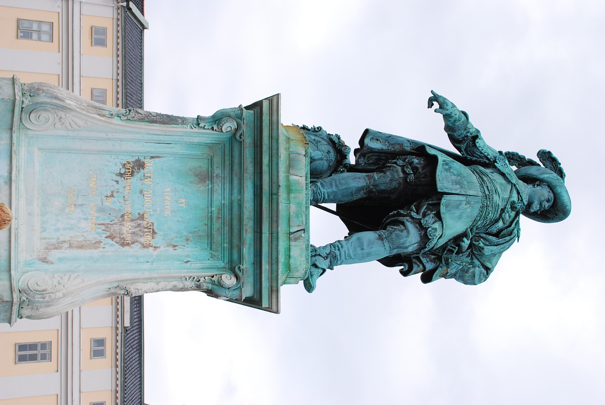
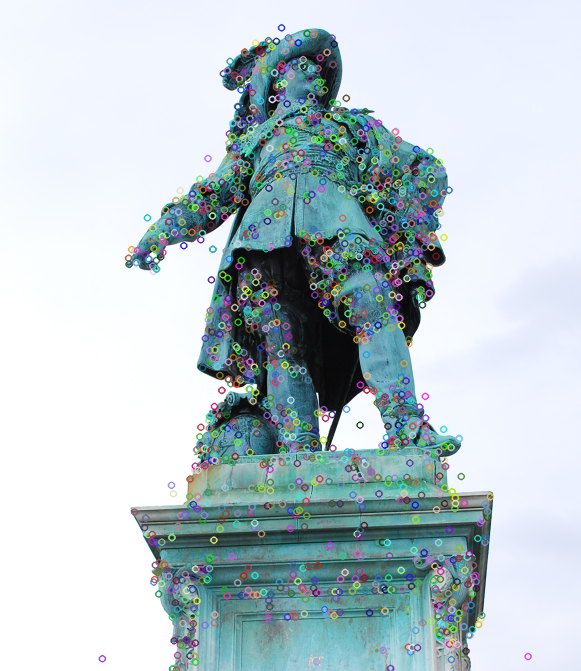
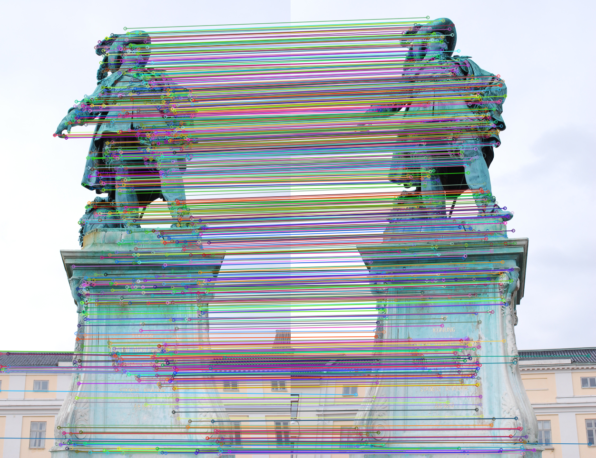
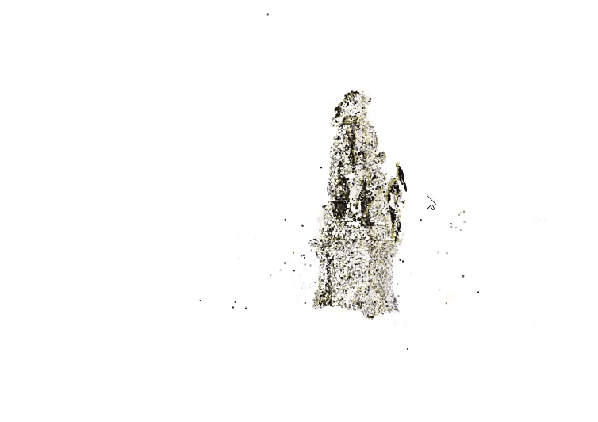

# Incremental Structure from Motion (SfM) for 3D Reconstruction

## Project Overview

This project focuses on the development of an incremental Structure from Motion (SfM) pipeline to reconstruct 3D point clouds from image sequences. The project includes camera calibration, feature detection, matching, initial reconstruction, and incremental expansion, aiming to generate an accurate 3D reconstruction.

---

## Table of Contents

1. [Introduction](#introduction)
2. [Theory](#theory)
   - Camera Calibration
   - Feature Detection & Matching
   - Initial Reconstruction
   - Incremental Camera Registration (PnP)
   - Triangulation & Bundle Adjustment
   - Colorization (Optional)
3. [Implementation](#implementation)
4. [Results](#results)
5. [Mathematics](#mathematics)
6. [References](#references)

---

## Introduction

The goal of this project is to reconstruct 3D models from 2D image sequences by estimating the camera poses and 3D geometry incrementally. We use methods like feature detection (e.g., SIFT/ORB), triangulation, bundle adjustment, and camera pose estimation to build a 3D point cloud.

---

# For Existing Dataset 

## Theory

### 1. Dataset Description

The dataset used in this project is taken from [Gustav II Adolf Dataset](https://www.maths.lth.se/matematiklth/personal/calle/dataset/dataset.html). Images and intrinsic parameters of the camera are given, which include the focal length and principal point.  
The intrinsic matrix **K** is defined as:

$$
K = \begin{bmatrix}
f & 0 & c_x \\
0 & f & c_y \\
0 & 0 & 1
\end{bmatrix}
$$

Where:
- \(f\) is the focal length,
- \(c_x, c_y\) are the coordinates of the principal point.  
The sample image of the data is shown below.



### 2. Feature Detection & Matching

Feature detection methods, particularly SIFT (Scale-Invariant Feature Transform), are used to identify keypoints across multiple images. These keypoints are then matched between the images to establish correspondences. Matching is typically done using a nearest neighbor search with a ratio test to eliminate ambiguous matches.

Mathematically, we can describe the feature matching process as follows:

#### 1. SIFT Keypoint Detection:

SIFT is used to detect stable keypoints that are invariant to scaling, rotation, and affine transformations. The process begins by creating a **Gaussian Pyramid** for each image, allowing the algorithm to detect keypoints at multiple scales. These keypoints are then described by local feature descriptors.          **cv2.SIFT_create(nfeatures)**

**Mathematical Formulation**:  
The descriptor for each keypoint \( (x, y) \) at scale \( \sigma \) is given by:

$$
\mathcal{D}(x, y, \sigma) = \left[ I(x, y), I(x + \Delta x, y + \Delta y) \dots \right]
$$

Where:
- \( \mathcal{D}(x, y, \sigma) \) represents the descriptor for the keypoint at location \( (x, y) \) at scale \( \sigma \),
- \( I(x, y) \) is the intensity at the point \( (x, y) \).

#### 2. Feature Matching Using FLANN:

After detecting the keypoints, descriptors are used to match keypoints between two images. A **FLANN-based Matcher** (Fast Library for Approximate Nearest Neighbors) is used to efficiently find the nearest neighbors of the descriptors.  **cv2.FlannBasedMatcher()**

**Mathematical Formulation**:  
The matching distance between two descriptors is computed using the Euclidean distance:

$$
\text{distance} = \| \mathcal{D}(x_1, y_1) - \mathcal{D}(x_2, y_2) \|
$$

Where:
- \( \mathcal{D}(x_1, y_1) \) and \( \mathcal{D}(x_2, y_2) \) are the descriptors of the matched keypoints in two images.

#### 3. Ratio Test (Lowe’s Method):

The **Ratio Test** (introduced by David Lowe) is used to filter out unreliable matches by comparing the distance between the best match and the second-best match. If the ratio between the distances is less than 0.7, the match is considered reliable.

**Mathematical Formulation**:  
The ratio test is defined as:

$$
\frac{d_1}{d_2} < 0.7
$$

Where:
- \( d_1 \) is the distance to the nearest neighbor,
- \( d_2 \) is the distance to the second nearest neighbor.

#### 4. RANSAC and Fundamental Matrix:

RANSAC (Random Sample Consensus) is used to estimate the **Fundamental Matrix** \( F \) that relates corresponding points between two images. The **Fundamental Matrix** can be defined as:    **cv2.findFundamentalMat(pts0,pts1,method = cv2.FM_RANSAC,ransacReprojThreshold,confidence)**

$$
x_j^T F x_i = 0
$$

Where:
- \( x_i \) and \( x_j \) are the homogeneous coordinates of the corresponding points in the two images,
- \( F \) is the **Fundamental Matrix**, which encodes the epipolar geometry between the two images.

RANSAC is used to reject outlier matches by iterating over random samples and computing the Fundamental Matrix for each sample.

#### 5. Drawing Matches:

Once the inliers are identified using RANSAC, we visualize the matches by drawing lines between the corresponding keypoints in the two images.
**  cv2.drawMatches **

The sample image is given below after feature matching. 



---

### 3. Initial Reconstruction

The first step in reconstruction is triangulation of 3D points from an initial pair of images. This is typically done by solving for the essential matrix \( E \), which relates the two views:

$$
E = K^T F K
$$

Where:
- \( E \) is the essential matrix,
- \( F \) is the fundamental matrix,
- \( K \) is the intrinsic camera matrix.

**Pose Recovery (Rotation and Translation)**:
   The pose (rotation \( R \) and translation \( t \)) between the two camera views can be recovered from the Essential Matrix using the camera's intrinsic matrix \( K \). The pose is given by:

   $$
   [R|t] = \text{recoverPose}(E)
   $$

   Where:
   - \( R \) is the 3x3 rotation matrix,
   - \( t \) is the 3x1 translation vector.

**Cheirality Check**:
   Cheirality refers to ensuring that points are in front of both cameras, meaning they have positive depth. This check is essential for valid 3D reconstruction. The valid points are those that satisfy the condition:

   $$
   z > 0
   $$

   Where \( z \) represents the depth (the third component of the 3D point in homogeneous coordinates).

**Triangulation**:
   Once the pose is recovered and cheirality is checked, we use triangulation to compute the 3D locations of points from corresponding 2D image points. The mathematical formulation for triangulation, given the two camera projection matrices \( P_1 \) and \( P_2 \) and the 2D points \( x_1 \) and \( x_2 \) in the two images, is:

   $$
   X = \text{Triangulate}(P_1, P_2, x_1, x_2)
   $$

   Where:
   - \( X \) is the 3D point in homogeneous coordinates,
   - \( P_1 \) and \( P_2 \) are the 3x4 projection matrices for the two camera views,
   - \( x_1 \) and \( x_2 \) are the 2D corresponding points in the two images.

**Normalization of Homogeneous Coordinates**:
   After triangulating the 3D points, they are typically returned in **homogeneous coordinates**. To convert them to **Euclidean coordinates**, we normalize them by dividing by the last coordinate:

   $$
   X_{\text{Euclidean}} = \frac{X_{\text{Homogeneous}}}{X_{\text{Homogeneous}}[3]}
   $$

   Where:
   - \( X_{\text{Euclidean}} \) is the 3D point in Euclidean coordinates,
   - \( X_{\text{Homogeneous}} \) is the 3D point in homogeneous coordinates.


### 4. Incremental Camera Registration (PnP)

The Pose-n-Point (PnP) problem is used to estimate the pose of each new image added to the reconstruction. The goal is to minimize the re-projection error:

$$
\min_{R,t} \sum_i \| x_i - \pi(K[R|t]X_i) \|^2
$$

Where:
- \( R \) and \( t \) are the rotation and translation that describe the camera pose,
- \( x_i \) are the 2D projections in the current image,
- \( X_i \) are the 3D points,
- \( \pi \) is the projection operator.

### 5. Triangulation & Bundle Adjustment

Triangulation is used to compute the 3D locations of points from corresponding 2D image points. Bundle Adjustment (BA) refines the camera poses and 3D points by minimizing the overall re-projection error:

$$
\min_{R_i, t_i, X_j} \sum_{i,j} \| x_{ij} - \pi(K[R_i X_j + t_i]) \|^2
$$

Where:
- \( x_{ij} \) are the 2D projections of the 3D points in the \( i \)-th camera view,
- \( X_j \) are the 3D points.

### 6. Colorization

To enhance the visualization of the 3D model, RGB values can be assigned to the 3D points by projecting them back to the original images and averaging the colors:

$$
x_i = \pi(K[R_i|t_i]X)
$$


---

## Implementation

The implementation follows these steps:

1. **Camera Calibration**: Perform using OpenCV functions such as `cv2.calibrateCamera()`.
2. **Feature Detection & Matching**: Use SIFT/ORB and filter outliers using Lowe’s ratio test.
3. **Initial Reconstruction**: Compute the essential matrix and triangulate initial points.
4. **Incremental Expansion**: Add new images, estimate poses using PnP, and perform triangulation.
5. **Bundle Adjustment**: Refine the 3D model and camera poses using optimization techniques.
6. **Colorization (Optional)**: Project 3D points back to the images to assign colors.

---

## Results

### 3D Point Cloud

- Point Cloud Visualizations
- Camera Trajectories

### Reprojection Error


---

## Requirements

- Python = > 3.10.11 

## Setup Instructions

To set up and run the project, follow these commands:

```bash
# Clone the repository
git clone https://github.com/Hassannawazish/Structure-from-Motion.git

# Navigate into the project directory
cd Structure-from-Motion

# Install the required dependencies
pip install -r requirements.txt

# Navigate to the 'src' directory
cd src

# Run the project
python main.py


---

## References

1. Hartley, R., & Zisserman, A. (2004). *Multiple View Geometry in Computer Vision*. Cambridge University Press.
2. OpenCV Documentation: [https://docs.opencv.org/](https://docs.opencv.org/)
3. Middlebury 3D Reconstruction Datasets: [https://vision.middlebury.edu/mview/data/](https://vision.middlebury.edu/mview/data/)
4. Lund University Datasets : [https://www.maths.lth.se/matematiklth/personal/calle/dataset/dataset.html)

